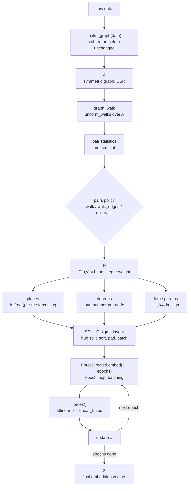
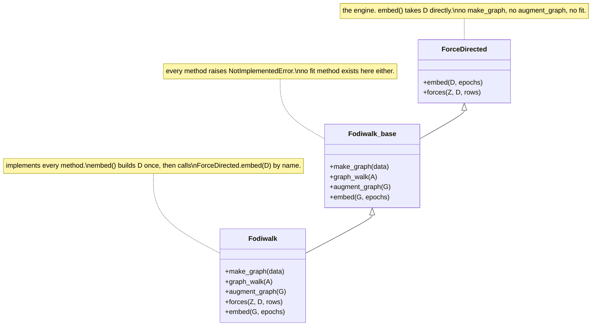

# Fodiwalk: a walk-augmented force-directed graph embedding method

Draft. 2026-08-23.

## 1. What Fodiwalk does

Fodiwalk turns a graph into a set of vectors. Each node gets one vector.
The method is force-directed: it moves each vector under simulated forces,
until the forces settle.

The forces do not come from the raw graph edges. They come from random
walks. A walk starts at a node and takes steps to random neighbors. The
walks find node pairs. Those pairs, and the number of steps between them,
decide the forces.

The module doc states the force sum for one node `u`:

```
F_u = sum over v in Walk(u) of F_uv^(a) + F_uv^(r)
```

`F_uv^(a)` is the attractive force between `u` and `v`. `F_uv^(r)` is the
repulsive force. `Walk(u)` is the set of nodes the walks from `u` reached.

## 2. Three stages

The code splits into three stages. Each stage has its own folder or file.
A model class wires the three stages together and holds nothing else.

| stage | what it does | where |
| --- | --- | --- |
| 1. graph construction | reads or builds the raw graph | `make_graph/` |
| 2. graph augmentation | runs the walks, builds the weighted matrix `D`, and prepares the data the force law needs | `augment_graph/` |
| 3. embedding | relaxes the vectors against `D`, using the force law | `core/`, `embed/` |

The project's own design note states the rule for stage 3 directly:
"This stage shall not do any graph analysis or data preparation. It must
only consume the data." (`dev-docs/fodiwalk-module.md`)

## 3. Stage 1: graph construction

`Fodiwalk.make_graph(data)` is a stub. It returns the data it is given,
unchanged. The code comment says why: "The stage stays in the API because
a later project builds the graph from raw data (kNN, MST) and changes this
method only." No such project exists yet in this package.

The real reader of graphs is `make_graph/datasets.py`. Its `load(name,
max_nodes=0, seed=42)` function reads a named dataset (`cora`, `pubmed`,
`roadnet_ca`, and others) from disk, and returns a symmetric CSR matrix
`A` and its node count `n`.

## 4. Stage 2: graph augmentation

### 4.1 The walk

The walk function is `uniform_walks(A, starts, walk_len, rng)`. It starts
one walk from each node in `starts`. At each step, every walk in progress
picks its next node uniformly at random among the current node's
neighbors. A node with no neighbor stays where it is.

The code states this walk is the same walk as DeepWalk, and the same walk
as node2vec when its two parameters `p` and `q` both equal 1.

`make_walker(A, n, p, q)` picks the walk function. At `p = q = 1` it
returns `uniform_walks` itself, not a general-purpose walk with those
parameters set to 1. The code states the explicit reason: a general
rejection-sampling walk draws one extra random number for every accepted
step, even at `p = q = 1`. That extra draw changes the walk, for the same
seed. Every recorded result before 2026-08-18 used `uniform_walks`
directly. Keeping the two paths separate keeps a default run reproducible
bit for bit.

*Note on a design document.* `dev-docs/fodiwalk-module.md` describes a
different baseline walk: one where every node `v` in `Walk(u)` has degree
`deg(v) >= deg(u)`. The walk function that runs, `uniform_walks`, has no
such rule; it is a plain uniform walk over neighbors. A rule close to this
description does exist in the code, but not inside the walk: it is
`with_neighbours_low_deg`, an optional way to add the graph's direct edges
to the augmented matrix, active only when `edge_rule = "low_deg"` (the
default is `"both"`). That function's own docstring states its reason is
memory, not the walk: an edge stored once, in the lower-degree node's row,
costs one matrix entry instead of two.

### 4.2 What a walk pair becomes

A walk does not use every step. It uses pairs of nodes that fall inside
one walk, within a window. For each such pair, the code counts three
numbers:

- `mn`: the smallest number of steps between the two nodes, across all
  walks
- `sm`: the sum of that step count, across all walks
- `cnt`: how many times the pair appeared inside the window

A separate function turns these three numbers into one weight, called
`h`. The default rule is `min_gap`, which uses `mn` directly. `h` is
always an integer of 1 or more. `h = 1` means the two nodes are direct
neighbors, or were added as such.

### 4.3 Three pair policies

The `pairs` setting picks one of three ways to turn a graph into pairs:

| name | what a row holds | direction |
| --- | --- | --- |
| `walk` | every pair inside a walk's window, capped per node | undirected |
| `walk_edges` | the same as `walk`, plus every real edge forced to `h = 1` | undirected |
| `nbr_walk` | every neighbor at `h = 1`, plus every node a walk reached | directed |

Each policy is one function, not a class. A registry, `POLICIES`, maps
the name to the function. The code states the reason for a registry over
a chain of `if` statements: an `if` chain once let a missing plane
silently take the values meant for a different force law, and the run
produced numbers with no error.

### 4.4 What stage 2 produces

Stage 2 builds the matrix `D`. A stored entry `D[u, v] = h` is the walk
weight described above. Stage 2 also builds:

- the **planes**: the arrays the force law reads. For the default law,
  these are `h` (the weight, taken directly from `D`) and `freq` (how
  often the pair appeared).
- the **degrees**: one number for each node, used to divide the summed
  force. The default source is the count of that node's `h = 1` entries.
- the **force params**: a small set of numeric constants the law reads
  (`k1`, `k4`, `kr`, and a sign).

A code comment states the explicit reason these three live in stage 2 and
not stage 3: "a plane and a degree are properties of the RECIPE (one pair
policy plus one force law) and not of the kernel that later reads them."
This decision was a change made during this project: the planes and the
degrees first lived in a folder called `embed/`, then moved to
`augment_graph/` for this stated reason.

## 5. Stage 3: embedding

### 5.1 The force law

The default law is `fdlinear`. Its code, read directly from
`core/forces.py`:

```python
def fdlinear(x, planes, params):
    h, freq = planes
    live = h > 0
    near = h <= 1

    ex = jnp.exp(params["sign"] * params["k4"] * x)
    Fa = jnp.where(near & live, params["k1"] * x, 0.0)
    coeff = jnp.where(near, params["kr"], h / jnp.maximum(freq, 1.0))
    Fr = jnp.where(live, -coeff * ex, 0.0)
    return Fa + Fr
```

`x` is the distance between the two embedding vectors. `h` and `freq` are
the two planes read for this pair.

In words:

- Attraction (`Fa`) fires only when `h = 1`: only direct or forced
  neighbors attract. Its size is `k1 * x`.
- Repulsion (`Fr`) fires whenever the pair is live (`h > 0`). Its
  coefficient is the constant `kr` when `h = 1`, and `h / freq` otherwise.
  It falls off with `exp` of the distance.

A second law, `fdlinear_fused`, computes the same result from one plane
instead of two. The code states the trade: this fused plane, `w`, is
computed once when `D` is built, so a law of the form `h / freq**beta`
could no longer change `beta` without rebuilding `D`.

A registry, `FORCE_PLANES`, states which planes each law reads, and in
what order. The code states the explicit reason: the layout code passes
planes to the law by position, not by name, so nothing checks the count
or the order on its own. A separate file, `plan_contract.py`, checks this
before every run.

### 5.2 The layout: SELL-C-sigma

`D` does not go to the force law row by row. It first becomes a batch
layout, built by `core/sell_c_sigma.py`. The steps, stated in the file's
own docstring:

1. **Hub split**: a row wider than `k_max` entries becomes several
   shorter rows, each a slice of the original.
2. **Width sort**: rows are sorted by width. Node order does not change;
   only the order of processing does.
3. **Ladder quantize**: each row's width rounds up to a fixed set of
   sizes, so nearby-width rows can share one padded shape.
4. **Packing**: rows of one padded width are grouped into batches.
5. **Pad**: any leftover space in a batch is filled with cells that add
   zero force.

The file states the explicit reason for this layout, instead of a more
common scatter-add over a flat edge list: a scatter-add's write order is
not fixed when many pairs share one source row on a GPU, "exactly the
pathology a power-law degree distribution maximizes." The padded batch
layout reduces each batch with a plain sum instead, which has one fixed
shape and no such write conflict.

### 5.3 The class hierarchy

Three classes divide the embedding work:

- **`ForceDirected`** (in `forcedirected/force_directed.py`; it was named
  `ForceDirectedEmbedding` between 2026-08-21 and 2026-08-26, and
  `fodiwalk/core/force_directed.py` forwards to it). The engine.
  It holds the epoch loop, the batching, the callback events, and the
  update of the vectors `Z`. Its `embed(D, epochs, ...)` method takes an
  already-built `D`. It has one method a subclass must supply: `forces`,
  the force law call for one batch of rows. It has no method for
  building or augmenting a graph.

- **`Fodiwalk_base`** (in `base.py`). States the contract of the Fodiwalk
  family. Every method here raises `NotImplementedError`: `make_graph`,
  `graph_walk`, `augment_graph`, and `embed`. A comment states the reason
  for this class: to hold the contract in one place, rather than let it
  be inferred from what one concrete class happens to define.

- **`Fodiwalk`** (in `model.py`). The concrete model. It implements all
  five methods above. Its own `embed(G, ...)` method calls
  `augment_graph(G)` one time to build `D`, then calls the engine's
  `ForceDirected.embed(D, ...)` directly by name, not through
  `super()`. The code states the reason for calling it by name: `super()`
  from `Fodiwalk.embed` would reach `Fodiwalk_base.embed` first, which
  raises.

There is no `fit` method anywhere in this hierarchy. It was removed. The
code states the reason: `make_graph` is a stub, so a `fit` method that
called `make_graph` then `embed` would promise a graph-building stage
that this project does not have.

## 6. Configuration

One class, `Config`, holds every setting. It is a flat dataclass: no
nested groups, and 39 fields. Three narrower, frozen views of it are built
once, when a `Fodiwalk` object is made:

- `AugmentSpec` — the settings stage 2 reads (`pairs`, `weight`, `far`,
  and others)
- `ForceSpec` — the settings stage 2 reads to build the law's data, and
  that stage 3's kernel later reads (`force`, `k1`, `k4`, `kr`)
- `PlanSpec` — the settings the layout stage reads (`b_cells`, `k_max`,
  `chunks`)

A comment states the reason for this split: each stage reads only its own
spec, so one stage cannot reach a setting that belongs to another.

## 7. Testing

The project has one test that checks a code change moved no number. It is
called the golden gate (`tests/golden.py`). It runs the augmentation on a
fixed graph, for 16 different settings, and stores a short hash of each
result array. Running it again and comparing the new hashes to the stored
ones tells whether anything changed, without storing the full arrays.

A second, larger test (`tests/test_parity.py`) reruns full recorded
experiments and checks the numbers against a written log from an earlier
run of the method.

## 8. Flow diagram





## 9. Open point for a later draft

Section 4.1 notes a difference between the walk rule described in
`dev-docs/fodiwalk-module.md` and the walk rule the code runs. A later
draft should resolve which one is correct, and update the losing side.
